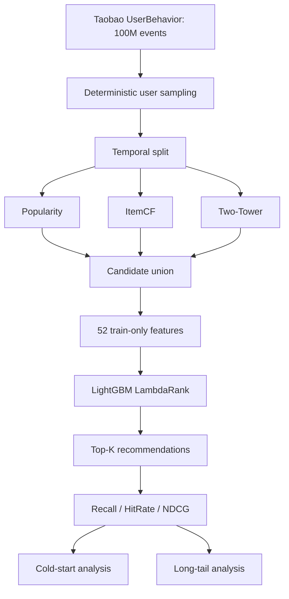
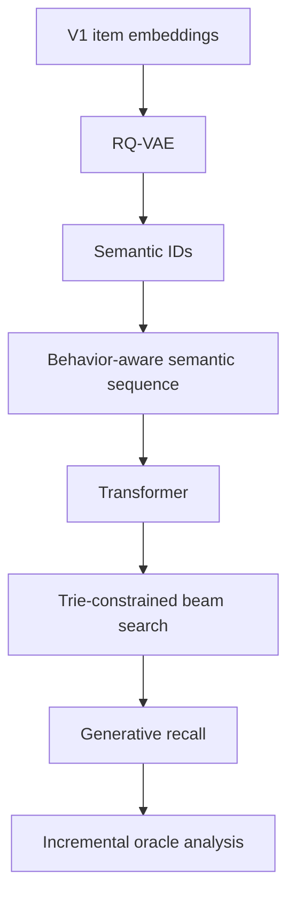
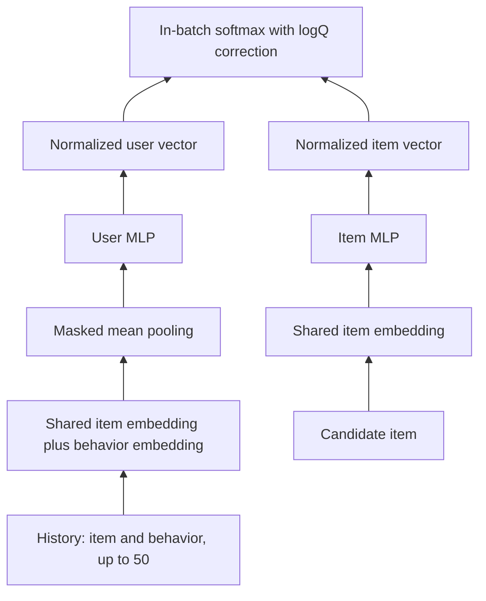

# Taobao Multi-Stage Recommender System with Generative Retrieval Extension

An end-to-end recommendation project built on the 100,150,807-interaction Taobao UserBehavior dataset. It implements a leakage-audited temporal data pipeline, Popularity/ItemCF/Two-Tower recall, multi-stage candidate union, 52-feature LightGBM LambdaRank, protected test evaluation, cold-start and long-tail diagnostics, plus an experimental collaborative Semantic-ID generative retriever.

The production-like main system is **Popularity + ItemCF + Two-Tower → candidate union → LambdaRank**. The generative branch is a completed research extension, not a production winner: it produced a small validation oracle gain but **zero incremental target hits on the protected test period**.

## 30-second summary

- **Scale:** 100.15M raw events; deterministic user-level 1% development sample with 1,001,832 events.
- **Protocol:** chronological train/validation/test split; all aggregates and histories obey the time boundary.
- **Main result:** LambdaRank reached test-warm Recall@10=`0.166771` and NDCG@50=`0.124189`; ItemCF retained slightly higher Recall@50 (`0.241398` vs `0.238792`).
- **Bottleneck:** candidate-oracle Recall@50=`0.255548`, only `0.016756` above the ranker; retrieval coverage is now the main constraint.
- **Research result:** RQ-VAE and trie-constrained generation were technically healthy, but the GenRec validation signal did not replicate on test. It remains an experimental baseline.

## Main System vs. Experimental Extension

### Main System

The frozen recommendation pipeline is:

```text
Popularity + ItemCF + Two-Tower
              ↓
       Candidate Union
              ↓
  52 train-only features
              ↓
   LightGBM LambdaRank
              ↓
      Final Top-K ranking
```

### Experimental Generative Extension

The extension is **TIGER-style collaborative Semantic-ID retrieval**, not an exact TIGER reproduction. Original TIGER-style systems commonly derive semantic representations from content; this dataset has no rich item text, so this experiment quantizes the purchase-aligned V1 collaborative item embedding. It is still closed-catalog and cannot generate a train-unseen item.

```text
V1 collaborative item embedding → RQ-VAE → unique Semantic ID
→ behavior-aware history → Transformer → trie-constrained beam search
→ standalone and incremental recall evaluation
```

## Dataset

| Dataset | Interactions |
|---|---:|
| Raw Taobao UserBehavior | 100,150,807 |
| Deterministic development sample | 1,001,832 |
| Train | 724,885 |
| Validation | 138,406 |
| Test | 138,541 |

The development sample uses `user_id % 100 == 0`. Sampling complete users is reproducible and preserves each selected user's full event history; row-level random sampling would fragment histories and damage sequential, collaborative and recency features. The raw CSV is approximately 3.67 GB and is intentionally excluded by `.gitignore`.

## Temporal Split and Leakage Control

This project does **not** use a random split. Events are divided chronologically:

| Split | Unix timestamp range |
|---|---|
| Train | 1511539200–1512143999 |
| Validation | 1512144000–1512230399 |
| Test | 1512230400–1512316799 |

Random splitting would allow future behavior to leak into user/item aggregates, sequence histories and purchase targets. Here, ranking aggregates are built only from train. Validation labels train the ranker; test labels are read only after test candidate scoring. For generative sequences, same-timestamp events are batched so every retained history event satisfies `history_timestamp < target_timestamp`.

## System Architecture





## Key Test Results

All values below use the same protected **test-warm purchase** population.

| Method | Recall@10 | Recall@20 | Recall@50 | NDCG@50 |
|---|---:|---:|---:|---:|
| Popularity | 0.001792 | 0.003136 | 0.009670 | 0.002553 |
| Two-Tower | 0.001344 | 0.001344 | 0.005376 | 0.001312 |
| ItemCF | 0.080257 | 0.124298 | **0.241398** | 0.075433 |
| RRF | 0.031138 | 0.054734 | 0.119191 | 0.032805 |
| LambdaRank | **0.166771** | **0.202315** | 0.238792 | **0.124189** |

LambdaRank substantially improved early ordering and NDCG. It did **not** beat ItemCF on every metric: ItemCF's Recall@50 was slightly higher by `0.002606`.

## Recall Models

### Popularity and ItemCF

Popularity provides a robust fallback but weak personalization. ItemCF was the dominant recall source, far outperforming the ID-only neural retriever under this sparse, short-window protocol.

### Two-Tower controlled experiments

The initial model optimized page-view positives but was evaluated on purchases, creating an objective mismatch. Controlled experiments kept vocabulary, model capacity, optimizer, negative sampling budget and exact full-catalog evaluation aligned.

| Experiment | Positive definition | Seed | Recall@50 |
|---|---|---:|---:|
| V0 | PV-only | historical | 0.003846 |
| V1 | Buy-only | 42 | **0.011966** |
| V1 replication | Buy-only | 2027 | 0.008405 |
| V2 | Multi-behavior | 42 | 0.007058 |

Purchase-aligned training improved directionally over PV-only, but Two-Tower remained much weaker than ItemCF. The preregistered alternate seed replicated the improvement direction; it did not establish strict stability. Seed 2027 was about **29.76% lower** than seed 42.

## Post-Freeze Sequence-Aware Retrieval Extension

After the original validation/test protocol was frozen, V3 was conducted entirely inside the historical training period. Original validation and protected test labels were not used for V3 training, checkpoint selection, or evaluation. V3 is an **internal temporal evaluation**, not a replacement protected-test result.

The experiment addressed two weaknesses of the historical Two-Tower: the ID-only user tower had no explicit recent-behavior representation, and uniform-negative pointwise BCE was a weak retrieval objective. The fixed internal split used 2017-11-25 through 2017-11-29 for training, 2017-11-30 for checkpoint selection, and 2017-12-01 for one held-forward evaluation. Mappings and the 248,244-item catalog came only from the internal training days.



The controlled models share the same temporal split, 10,254 strict-history purchase examples, batch order, objective, optimizer, dimensions, candidate catalog, and exact full-catalog evaluation. Their primary architectural difference is the user representation: V3A used a user-ID embedding, while V3B used behavior-aware masked mean pooling over the last 50 events. Because V3B shares the item embedding table between the history encoder and candidate tower, history-side gradients additionally update item embeddings appearing in sequence contexts; therefore this is not a perfectly isolated single-parameter causal experiment. No historical-item filtering was applied.

A final read-only coverage audit found 9,318 purchase-target items (`3.7536%` of the 248,244-item catalog) and 101,095 non-padding history items (`40.7240%`) across the retained windows. Their union contains 102,422 items (`41.2586%`), leaving 145,822 (`58.7414%`) without item-specific data gradients in V3B. Thus, the broad claim that 96% of the V3 catalog was never trained is incorrect. Approximately `96.2464%` of V3A base item embeddings were not target-exposed, but V3B's shared history path substantially broadened item-specific exposure.

| Internal EVAL model | Recall@20 | Recall@50 | HitRate@50 | NDCG@50 | Dominant Top-1 | Top-50 coverage |
|---|---:|---:|---:|---:|---:|---:|
| Popularity | 0.002990 | 0.006579 | 0.008373 | 0.001784 | 1.000000 | 0.000201 |
| Internal ItemCF | 0.166071 | **0.284179** | **0.319378** | **0.090782** | 0.002392 | **0.147927** |
| V3A ID + InBatch + logQ | 0.001396 | 0.002791 | 0.003589 | 0.001418 | 0.002392 | 0.142525 |
| V3B Sequence + InBatch + logQ | 0.008971 | 0.016547 | 0.019139 | 0.006376 | 0.002392 | 0.141582 |

V3B improved Recall@50 over the controlled ID baseline by `+0.013756`, supporting the value of explicit recent history under this internal protocol. However, dominant Top-1 share was unchanged, Top-50 coverage was `0.000943` lower, and V3B still trailed internal ItemCF by `0.267632` Recall@50. The preregistered result is therefore **mixed**. The project is frozen after this single internal evaluation; V3 was not inserted into the historical union and no protected test was rerun. Full details are in [`reports/V3_SEQUENCE_RETRIEVAL.md`](reports/V3_SEQUENCE_RETRIEVAL.md).

## Candidate Union and Fusion

The fixed union takes ItemCF Top-200, Two-Tower Top-100 and Popularity Top-50, deduplicated to at most 350 items per user. Each row preserves source provenance, source-specific rank and score, `recall_source_count`, and an RRF score.

Naive RRF was a meaningful failure:

| Validation method | Recall@50 |
|---|---:|
| ItemCF | 0.371696 |
| RRF | 0.179821 |

Ranks from heterogeneous sources were not equally calibrated. Treating a dominant ItemCF rank and a weak-source rank as comparable severely diluted the strong source. Low candidate overlap alone did not imply useful incremental ground-truth coverage.

## Ranking

The ranker is LightGBM LambdaRank with 52 features in five groups:

- recall features: source flags, ranks, scores and source count;
- user features: train-only activity, behavior mix and recency;
- item features: train-only popularity, purchase statistics and category;
- user-item features: interaction counts, behavior counts and recency;
- user-category features: preference and affinity signals.

All aggregates come from train. Raw `user_id` and `item_id` are not numeric model features. The ranker is fit with validation candidate labels and evaluated once on the protected test period.

### Candidate oracle

Test-warm candidate-oracle Recall is `0.255548`; ranker Recall@50 is `0.238792`, leaving only `0.016756` absolute gap. The ranker is already close to the ceiling of its inputs, so retrieval coverage—not merely a larger ranker—is the primary next bottleneck.

## Cold Start

Cold start is diagnosed, not solved. Among 2,512 test purchase interactions, 962 (`38.30%`) target items are absent from train. A closed-catalog collaborative system therefore has a maximum interaction-level ceiling of `0.617038`. Ranker full-test interaction Recall@50 is `0.154061` (the historical macro value is `0.159307`). A real solution requires test-time-available metadata or a content encoder.

## Long Tail

Item segments are defined only from train interaction frequency: Head=top 20%, Torso=next 30%, Tail=remaining 50%.

| Segment | Ranker Recall@50 | Candidate Oracle Recall@50 |
|---|---:|---:|
| Head | 0.271739 | 0.290217 |
| Torso | 0.246291 | 0.261128 |
| Tail | 0.184300 | 0.197952 |

The low Tail oracle shows that Tail performance is mainly constrained by retrieval coverage. The current Two-Tower is **not** a Tail recall source: Tail Recall@50=`0`, Tail-exclusive hits=`0`, exposure Head=`84.99%`, Tail=`0.36%`.

## Generative Retrieval Results

### RQ-VAE and Semantic IDs

The source matrix contains 302,016 L2-normalized V1 item embeddings of dimension 64. A three-level RQ-VAE with 128 codes per level reached validation reconstruction loss `0.00188850`. Codebook utilization was `100% / 100% / 100%`, with perplexity `108.7562 / 114.9056 / 113.1856`; no codebook collapse was observed.

Raw `(c0,c1,c2)` tuples were not unique: 302,016 items produced 248,774 unique tuples, a `17.6289%` collision-excess rate. Within each collision group, sorting by `item_id ASC` and assigning a deterministic suffix produced `(c0,c1,c2,suffix)` with final collision count `0` and a one-to-one item↔SID mapping. The suffix guarantees reversibility; it does not add semantic capacity to the first three codes.

### Behavior-aware Transformer

Each retained event is represented by a behavior token (`<PV>`, `<FAV>`, `<CART>`, `<BUY>`) plus its Semantic ID and separator. The model is a PyTorch encoder-decoder Transformer with `d_model=128`, 4 heads, 2 encoder layers and 2 decoder layers. It trains on 12,207 strict-causal purchase examples. Same-timestamp batching conservatively excludes ambiguous simultaneous events from the target's history.

### Trie-constrained generation

A prefix trie restricts beam search to SIDs in the active catalog. Validation and test both achieved 100% valid generation, zero invalid paths and zero duplicate items. This is an engineering guarantee, not a relevance guarantee: **valid output does not imply good or complementary recommendations**.

### Frozen metrics

| Split | Recall@20 | Recall@50 | Union oracle before | Union + Gen | Incremental hits |
|---|---:|---:|---:|---:|---:|
| Validation | 0.063319 | 0.065456 | 0.384716 | 0.386426 | 2 |
| Test | 0.042458 | 0.042458 | 0.255548 | 0.255548 | 0 |

Test incremental hits versus ItemCF=`0`, versus current union=`0`, and Tail=`0`. Test exposure was Head=`78.08%`, Torso=`19.32%`, Tail=`2.60%`, with Gini=`0.988493`. Validation showed a small positive signal that did not replicate on the protected test period. Current GenRec is therefore retained as an experimental baseline rather than a production recall source.

## Key Findings

1. A purchase-aligned Two-Tower objective improved directionally over PV-only training.
2. Sampled BCE validation loss was poorly aligned with exact full-catalog retrieval quality.
3. ItemCF dramatically outperformed the ID-only neural retriever in this data regime.
4. Low overlap between recall sources did not imply meaningful incremental target recall.
5. Naive RRF severely hurt a dominant strong source when source ranks were miscalibrated.
6. LambdaRank improved early-order quality and NDCG but remained bounded by candidate recall.
7. Tail performance was primarily a retrieval-coverage problem, not just a ranking problem.
8. Two-Tower exposure was extremely Head-heavy and provided no Tail-exclusive hits.
9. Healthy Semantic-ID quantization did not guarantee complementary generative recall.
10. Trie constraints guaranteed valid items, but validity did not guarantee diversity or business value.
11. A validation improvement must survive the protected test period before entering the main pipeline.
12. Collaborative Semantic IDs remain closed-catalog and cannot solve true cold-item recommendation.

## What Did Not Work

### PV-only Two-Tower

Page-view positives optimized a behavior that did not match purchase evaluation. Its Recall@50 was only `0.003846`.

### Multi-behavior weighting

Adding behavior weights did not beat Buy-only V1 and retained severe recommendation concentration. More signals did not automatically produce a better objective.

### Reciprocal Rank Fusion

RRF reduced validation Recall@50 from ItemCF's `0.371696` to `0.179821` because heterogeneous source ranks were treated too similarly.

### The Two-Tower long-tail assumption

The neural retriever was not a long-tail complement: Tail Recall@50 and Tail-exclusive hits were both zero.

### Generative retrieval as a fourth source

RQ-VAE health metrics and constrained-generation validity were strong, but the two validation-only incremental hits did not replicate on test. Engineering success, representation quality and system-level complementary recall are three distinct questions.

## Project Structure

```text
taobao-recsys/
├── configs/                         # frozen generative configuration
├── data/                            # local raw/interim/processed data (Git-ignored)
├── notebooks/                       # data, baselines, V0 and controlled experiments
├── scripts/                         # reproducible recall/rank/analysis/generative stages
├── generative/                      # RQ-VAE, sequence, Transformer, trie and metrics
├── tests/                           # 45 regression/unit tests
├── artifacts/                       # frozen outputs; large binaries are Git-ignored
│   ├── two_tower/
│   ├── multistage_recall/
│   ├── ranking/
│   ├── analysis/
│   ├── generative/
│   ├── v3_sequence_retrieval/        # frozen internal temporal extension
│   └── final/
├── reports/                         # final/V3 reports, resume bullets, interview cheatsheet
├── CURRENT_PROJECT_STATUS.md
├── PROJECT_ISSUES.md
├── EXPERIMENT_FREEZE.md
└── requirements.txt
```

## Quick Start

### Environment

Reported artifacts were produced with Python 3.13.9 on CPU. From PowerShell:

```powershell
py -3.13 -m venv .venv
.\.venv\Scripts\Activate.ps1
python -m pip install -r requirements.txt
```

Register the environment as a notebook kernel with `python -m ipykernel install --user --name taobao-recsys` if needed. `faiss-cpu` is optional and was **not used** in reported results.

### Inspect the frozen project safely

```powershell
python -m unittest discover -s tests -p "test_*.py" -v
python scripts/run_generative_pipeline.py
```

The generative runner detects `artifacts/generative/final_summary.json` and refuses to retrain or repeat protected test evaluation. Read [CURRENT_PROJECT_STATUS.md](CURRENT_PROJECT_STATUS.md), [PROJECT_ISSUES.md](PROJECT_ISSUES.md), [EXPERIMENT_FREEZE.md](EXPERIMENT_FREEZE.md) and the [final technical report](reports/FINAL_PROJECT_REPORT.md) for frozen evidence.

### Expensive reproduction entry points

These commands are documented for reproducibility, but they build or overwrite stage outputs and **must not be run against this frozen workspace**. Reproduce them only in a fresh copy with separately named artifact directories and a new evaluation protocol.

```powershell
python scripts/07_build_multistage_recall.py
python scripts/08_train_ranker.py
python scripts/09_analyze_cold_start_long_tail.py
python scripts/run_generative_pipeline.py
```

Do not delete freeze files to force another run. The current test period has already been consumed for the final traditional, cold/long-tail and generative diagnoses.

## Reproducibility and Artifact Policy

- Small configs, metrics, manifests and reports describe the results in Git-friendly form.
- Raw data, checkpoints, NumPy arrays and Parquet datasets remain local and are excluded from Git by default.
- Important local outputs and their reproduction stages are listed in [artifacts/ARTIFACT_MANIFEST.md](artifacts/ARTIFACT_MANIFEST.md).
- The authoritative machine-readable project summary is [artifacts/final/project_summary.json](artifacts/final/project_summary.json).
- No current metric should be used for further model selection on the existing test period.

## Historical Research Directions

The project is in final freeze; these are possible directions for a separate future project, not planned work in this workspace:

1. Use a genuinely new temporal or rolling protocol for any new model selection.
2. Require incremental-oracle gains before integrating a new warm retriever.
3. Add a metadata/content encoder for true cold-item retrieval.
4. Study Tail-aware objectives without reusing the consumed protected test or V3_EVAL as feedback.
5. Benchmark FAISS/ANN engineering against the exact retrieval baseline.

## Documentation

- [Current project status](CURRENT_PROJECT_STATUS.md)
- [Issue and failure log](PROJECT_ISSUES.md)
- [Experiment freeze policy](EXPERIMENT_FREEZE.md)
- [Final project report](reports/FINAL_PROJECT_REPORT.md)
- [V3 sequence retrieval report](reports/V3_SEQUENCE_RETRIEVAL.md)
- [Resume bullets](reports/RESUME_BULLETS.md)
- [Interview cheatsheet](reports/INTERVIEW_CHEATSHEET.md)
